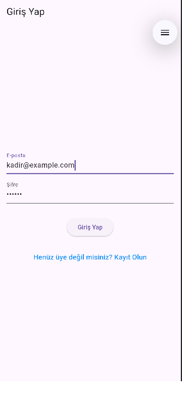
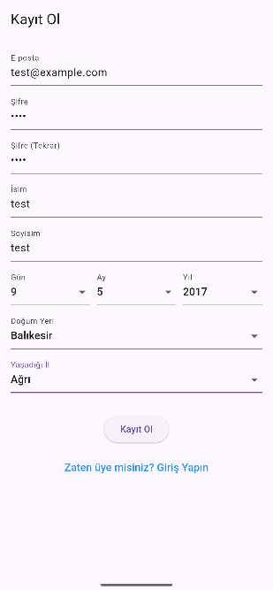
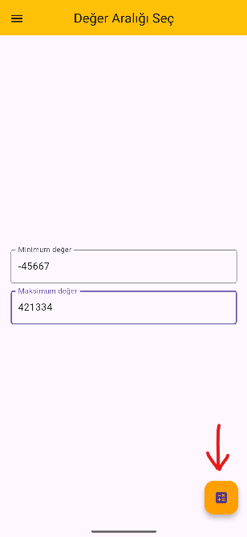
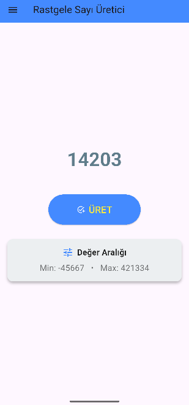
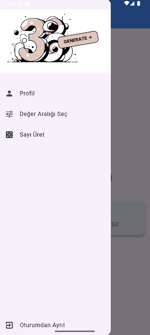
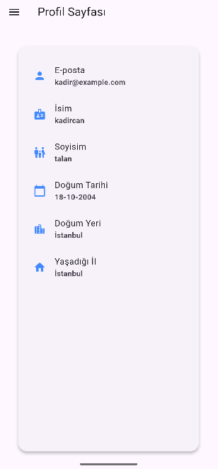
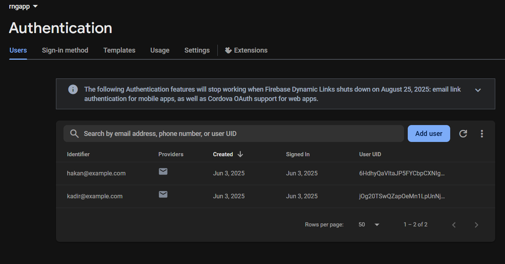
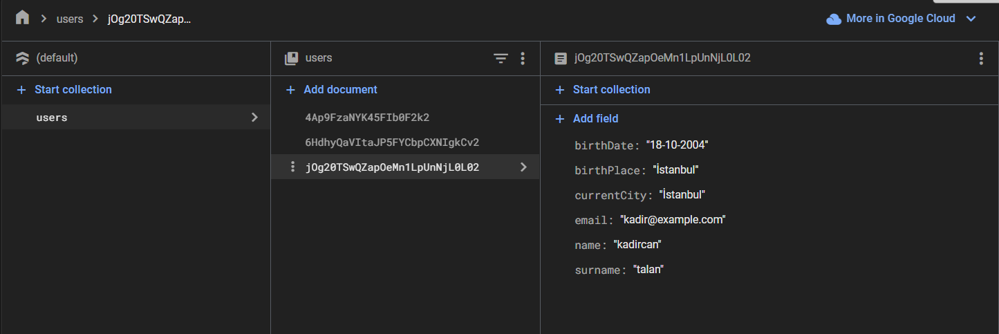

# RNGApp – Rastgele Sayı Üretici Mobil Uygulaması

---

## Projenin Amacı

Bu uygulama, kullanıcıların belirlediği aralıkta rastgele sayı üretmesini sağlayan, güvenli ve kolay kullanımlı bir Flutter tabanlı mobil uygulamadır.  
Amaç, hem modern hem geleneksel yaklaşımı birleştirerek hem Firebase hem de cihazda veritabanı saklama (SQLite & SharedPreferences) ile güvenli, esnek bir deneyim sunmaktır.

---

## Teknik Detaylar

- **Flutter:** Uygulamanın temel geliştirme platformu
- **Firebase:** Kimlik doğrulama (Authentication) ve kullanıcı verisi için bulut altyapısı
- **SQLite (sqflite):** Cihaz üzerinde kullanıcı verisi saklama
- **SharedPreferences:** Oturum bilgisi ve kullanıcı tercihlerinin cihazda tutulması
- **Material Design:** Modern ve kullanıcı dostu arayüz

---

## Öne Çıkan Özellikler

- **Kullanıcı Girişi:** Firebase Authentication ile güvenli giriş ve kayıt
- **Kullanıcı Verisi:** Giriş yapan kullanıcının bilgileri hem Firebase hem de cihazda saklanır
- **Aralık Belirleme:** Minimum ve maksimum değer girerek rastgele sayı üretme
- **Drawer Menü:** Sol üst köşeden açılan menü ile hızlı navigasyon
- **Oturum Kaydı:** Son giriş yapan e-posta bir sonraki giriş ekranında otomatik görünür
- **Modern Arayüz:** Responsive tasarım, sade ve anlaşılır görünüm

---

## Kullanılan Teknolojiler

- **Flutter**
- **Firebase Authentication & Firestore**
- **SQLite (sqflite)**
- **SharedPreferences**
- **Material Design**

---

## Sayfa ve Ekranların Görevleri ve Görünümleri

1. **Giriş Ekranı (`log_in_screen.dart`)**
   - Kullanıcı e-posta ve şifre ile giriş yapar
   - Son giriş yapan e-posta otomatik gelir
   - Giriş başarılıysa “Değer Aralığı Seçimi” ekranına yönlendirilir

    

2. **Kayıt Ol Ekranı (`sign_up_screen.dart`)**
   - Yeni kullanıcılar e-posta, şifre, isim, soyisim, doğum yeri ve şehir ile kayıt olur
   - Bilgiler Firebase’e ve SQLite’a kaydedilir

    

3. **Değer Aralığı Seçimi (`input_taking_screen.dart`)**
   - Minimum ve maksimum değerler alınır
   - Doğru giriş yapıldığında Rastgele Sayı ekranına geçilir

    

4. **Rastgele Sayı Üretici (`random_generator_screen.dart`)**
   - Belirlenen aralıkta rastgele sayı üretir ve ekranda gösterir
   - “Üret” butonuna basıldıkça yeni sayı üretir

    

5. **Drawer Menü (`drawer.dart`)**
   - Uygulamanın logosu, aralık seçimi ve çıkış bağlantısı burada

    

6. **Profil Ekranı (`profile_page.dart`)**
   - Kullanıcı bilgileri (isim, soyisim, doğum tarihi vs.) gösterilir

    


---

## Drawer Menü ve Logo API Bilgileri

- Drawer menüsündeki logo:  
    
  Kaynak: [All Good Great](https://allgoodgreat.com)
- Logo, uygulama genelinde API'den çekilerek gösterilir.

---

## Kullanıcı Oturumu ve Bilgilerin Saklanması

- Kullanıcı giriş bilgileri, güvenli şekilde Firebase Authentication'da saklanır.

  

- Son giriş yapılan e-posta **SharedPreferences** ile cihazda tutulur ve giriş ekranında otomatik çıkar.

- Kullanıcı profili ve diğer bilgiler hem Firebase Firestore’da hem de cihazda (SQLite) saklanır.

  

---

## Klasör ve Kod Yapısı

```
├── database/
│ └── user_database.dart
├── screens/
│ ├── input_taking_screen.dart
│ ├── log_in_screen.dart
│ ├── profile_page.dart
│ ├── random_generator_screen.dart
│ └── sign_up_screen.dart
├── services/
│ └── shared_preferences_service.dart
├── utils/
│ └── global_range.dart
├── widgets/
│ ├── base_page.dart
│ ├── custom_app_bar.dart
│ └── drawer.dart
├── firebase_options.dart
└── main.dart

```
- **database/**: Veritabanı işlemlerini içeren dosyalar.
   - `user_database.dart`: SQLite ile kullanıcı kayıt işlemleri.
- **screens/**: Tüm uygulama ekranları (sayfaları) burada.
   - `log_in_screen.dart`, `sign_up_screen.dart`, `input_taking_screen.dart`, `random_generator_screen.dart`, `profile_page.dart`
- **services/**: Uygulama servisleri (örn. SharedPreferences işlemleri).
   - `shared_preferences_service.dart`
- **utils/**: Yardımcı/fonksiyonel dosyalar.
   - `global_range.dart`: Global değişkenler ve yardımcı yapılar.
- **widgets/**: Tekrar tekrar kullanılan özel arayüz bileşenleri.
   - `base_page.dart`, `custom_app_bar.dart`, `drawer.dart`
- **firebase_options.dart**: Firebase proje ayarlarının bulunduğu dosya.
- **main.dart**: Uygulamanın giriş (ana) noktası.